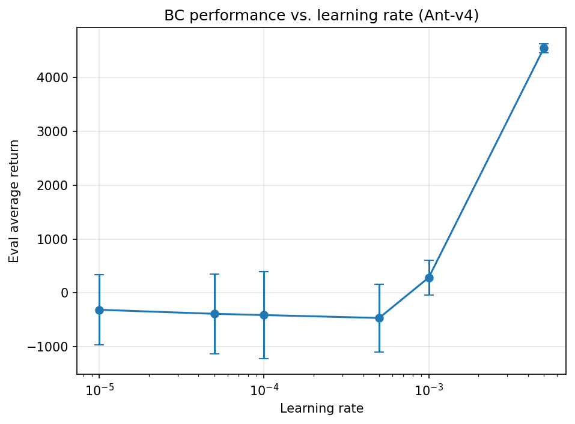
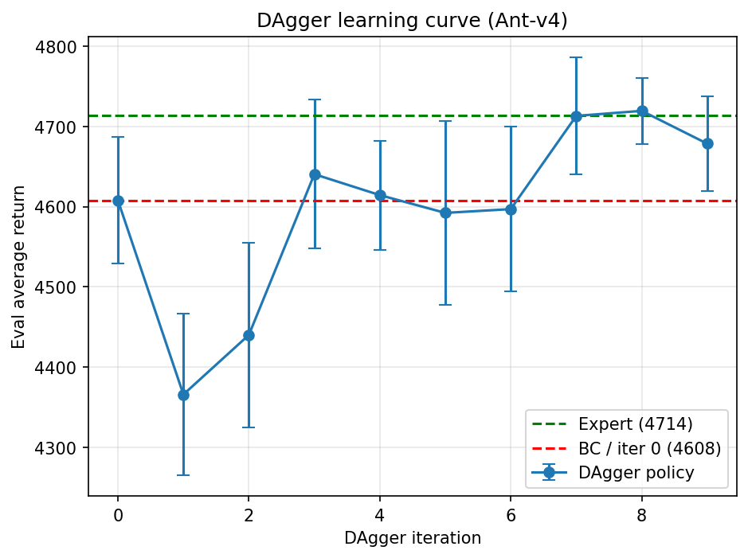
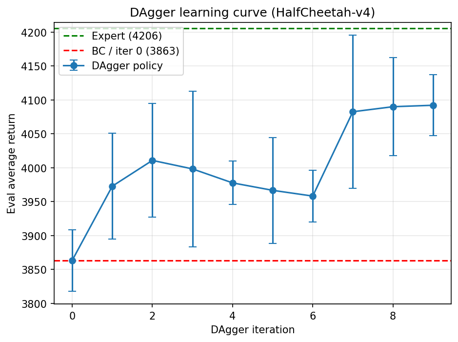

# Imitation Learning for Continuous Control

An implementation and empirical study of two imitation learning algorithms —
Behavioral Cloning (BC) and DAgger (Dataset Aggregation) — on high-dimensional
MuJoCo locomotion tasks. The project trains neural-network policies to imitate
expert demonstrations and analyzes when naive cloning succeeds, when it fails,
and how interactive expert relabelling closes the gap.

## Overview

Behavioral cloning treats imitation as supervised learning: fit a policy to a
fixed dataset of expert state–action pairs. This works when the learned policy
stays close to the expert's state distribution, but small errors compound,
drifting the agent into states the expert never visited. DAgger addresses this
distribution shift by iteratively collecting states from the *learner's* own
rollouts and relabelling them with the expert, growing an aggregated dataset
that covers the states the policy actually encounters.

This project evaluates both methods on two tasks of differing difficulty and
characterizes their behavior through controlled experiments.

## Methods

| Component | Specification |
|---|---|
| Policy | MLP, 2 hidden layers × 64 units, `tanh` activations |
| Output | Diagonal Gaussian (continuous actions) |
| Optimizer | Adam |
| Gradient steps / iteration | 1000 |
| Evaluation | 5000 environment steps per checkpoint (≈5 rollouts of length 1000); mean ± std reported over rollouts |
| Environments | `Ant-v4` (111-dim obs), `HalfCheetah-v4` (17-dim obs) |
| Expert data | One demonstration dataset per task |

## Behavioral Cloning

A single round of supervised fitting to the expert dataset, evaluated against
the expert's own return.

| Task | Policy Return (mean ± std) | Expert Return | Fraction of Expert |
|---|---:|---:|---:|
| `Ant-v4` | 4548.1 ± 84.0 | 4713.7 | 96.5% |
| `HalfCheetah-v4` | 3705.3 ± 91.8 | 4205.8 | 88.1% |

On `Ant-v4`, cloning alone recovers ~96% of expert performance — the expert's
demonstrations cover the state space densely enough that supervised fitting
generalizes well. `HalfCheetah-v4` serves as the second reference task.

## Sensitivity to Learning Rate

To probe the limits of cloning under a fixed training budget, the learning rate
was swept across two orders of magnitude on `Ant-v4`, holding all else constant.
The learning rate governs how far each Adam update moves the parameters; under a
small, fixed budget of 1000 gradient steps, it directly determines whether the
policy can fit the expert data in time.

| Learning Rate | Policy Return (mean ± std) |
|---:|---:|
| 1e-5 | -314.8 ± 653.1 |
| 5e-5 | -390.0 ± 742.8 |
| 1e-4 | -413.0 ± 805.7 |
| 5e-4 | -467.3 ± 627.6 |
| 1e-3 | 284.3 ± 322.7 |
| 5e-3 | 4548.1 ± 84.0 |

The relationship is sharply nonlinear: only the largest learning rate converges
to expert-level return, while smaller rates leave the policy effectively
untrained. This is a direct consequence of the limited step budget — at low
learning rates the optimizer has not traversed enough of the loss landscape in
1000 steps to produce a competent policy. The result underscores that reported
cloning performance can hinge entirely on optimization budget, not just data.

**Figure 1.** Policy return as a function of learning rate (log scale); error
bars show standard deviation across evaluation rollouts.

## DAgger

DAgger was run for 10 aggregation iterations per task. Iteration 0 is identical
to pure behavioral cloning; each subsequent iteration rolls out the current
policy, relabels the visited states with the expert, and retrains on the
aggregated dataset.

### `Ant-v4`

Expert return: 4714 · Behavioral cloning (iteration 0): 4608

| Iteration | Mean Return |
|---:|---:|
| 0 | 4608 |
| 1 | 4366 |
| 2 | 4440 |
| 3 | 4640 |
| 4 | 4614 |
| 5 | 4592 |
| 6 | 4597 |
| 7 | 4713 |
| 8 | 4719 |
| 9 | 4678 |

**Figure 2.** DAgger learning curve on `Ant-v4`. Dashed lines mark expert (4714)
and behavioral-cloning (4608) performance; error bars show standard deviation
across evaluation rollouts.

### `HalfCheetah-v4`

Expert return: 4206 · Behavioral cloning (iteration 0): 3863

| Iteration | Mean Return |
|---:|---:|
| 0 | 3863 |
| 1 | 3973 |
| 2 | 4011 |
| 3 | 3998 |
| 4 | 3978 |
| 5 | 3967 |
| 6 | 3958 |
| 7 | 4082 |
| 8 | 4090 |
| 9 | 4092 |

**Figure 3.** DAgger learning curve on `HalfCheetah-v4`. Dashed lines mark expert
(4206) and behavioral-cloning (3863) performance; error bars show standard
deviation across evaluation rollouts.

## Findings

On both environments DAgger improves over pure cloning and converges toward
expert performance — reaching ~4719 on `Ant-v4` (essentially matching the expert
at 4714) and climbing from 3863 to ~4092 on `HalfCheetah-v4`. The gains are
most pronounced in the later iterations, once the aggregated dataset has
accumulated enough learner-visited states to correct the policy's drift. This is
the signature of resolving distribution shift: by training on the states the
policy actually encounters, the agent stops falling into the out-of-distribution
failure modes that limit naive cloning.
